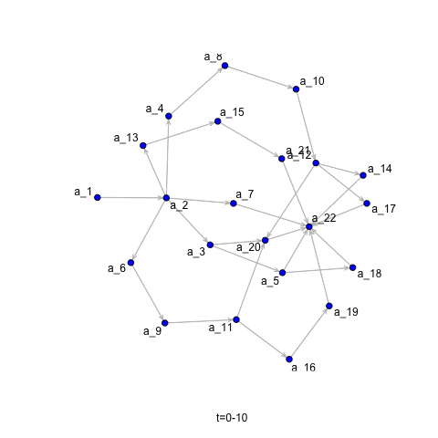

# Load necessary libraries

```{r,warning=FALSE,message=FALSE}
library(mfpp) # Matrix-based projects
library(igraph) # Graph Analysis
library(network) # Graph Analysis
library(networkDynamic) # Dynamic Network Analysis
library(ndtv) # Visualization for DN
library(htmlwidgets) # Visualization for DN
library(tsna) # Time-Series Aalysis for DN
library(ergm) # Spreading
```

```{r, setup}
library(rgl)
knitr::knit_hooks$set(webgl = hook_webgl)
```

# Load necessary database

```{r,warning=FALSE,message=FALSE}
PDM_list<-Batselier$`C2011-03 Family Day`$PDM_list
plot(PDM_list,type="orig")
```


```{r,warning=FALSE,message=FALSE}
PDM<-PDM_list$PDM 
DSM<-PDM[,1:nrow(PDM)] 
TD<-PDM[,nrow(PDM)+1]
SCHED<-tpt(DSM,TD)
diag(DSM)<-0 #Adjacency matrix
G<-graph_from_adjacency_matrix(DSM,mode="directed")
plot(G,vertex.size=2.5,edge.arrow.size=0.4,layout=layout_as_tree)
```

# Networks

```{r,warning=FALSE,message=FALSE}
N<-as.network(DSM)
plot(N)
```

# Convert it network to dynamic network

```{r}
activate.vertices(N,at=0)
activate.vertices(N,onset=as.numeric(SCHED$EST),terminus = as.numeric(SCHED$EFT))
print(N)
```

## Plot network between in time: 1-300

```{r}
plot(network.extract(N,onset=1,terminus=300))
```
## Render animation

```{r,warning=FALSE,message=FALSE,resize.height='asis'}
compute.animation(N, animation.mode = "kamadakawai",slice.par=list(start=0,end=SCHED$TPT,interval=10,aggregate.dur=10, rule='any'))
render.d3movie(N,displaylabels=TRUE,output.mode = "htmlWidget",animateOnLoad=TRUE) 
#render.d3movie(N)
#render.animation(N,displaylabels=TRUE) 
```


## Show network parameters

### Plot like a Gantt chart

```{r message=FALSE, warning=FALSE}
timeline(N) # Like a Gantt Chart
```

### Plot like a multilayer network

```{r,warning=FALSE,message=FALSE}
timePrism(N,at=c(1,300,500),
          displaylabels=TRUE,planes = TRUE,
          label.cex=0.5)
```


# Compute some basic temporal stats

```{r}
plot( tSnaStats(N,'gden') , ylab="density",main ="Denisty in time")# Density
plot( tSnaStats(N,'components') , ylab="components",main ="Compomemts in time")# Components
```


## Save animation into an animated GIF file

```{r,warning=FALSE,message=FALSE}
saveGIF(render.animation(N,vertex.col='blue',edge.col='gray',render.cache='none'),movie.name="N_movie.gif")
```


